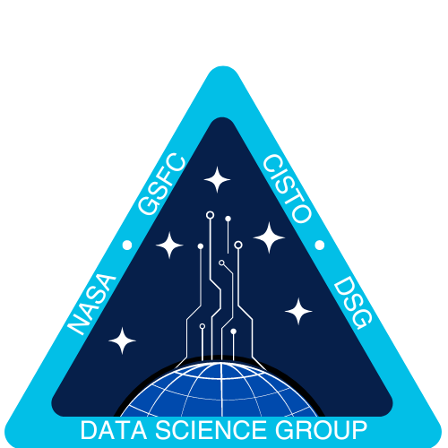

<p align="center">
    
</p>

# SatVision-TOA: A Geospatial Foundation Model for All-Sky Remote Sensing Imagery

[](https://zenodo.org/badge/latestdoi/472450059)
[](https://github.com/nasa-nccs-hpda/pytorch-caney/blob/docs/README.md)
[](https://arxiv.org/abs/2411.17000)

Implementation of the SatVision-TOA model for All-Sky Remote Sensing Imagery.

_The package includes the pretrained SatVision-TOA model along with fine-tuned versions for both 1) Image Reconstruction and 2) 3D Cloud Retrieval._
_While instructions for training the model are provided for reference, this deployment is primarily intended for downstream SatVision-TOA task usage and customization._

Concept and design details are provided in the paper on [arXiv.](https://arxiv.org/pdf/2411.17000)

Contents:

- [What is SatVision-TOA?](#what-is-satvision-toa)
- [Why use SatVision-TOA?](#why-satvision-toa)
- [Getting Started](requirements/README.md)
- [User Guide](USER_GUIDE.md)
  - [Image Reconstruction](USER_GUIDE.md#pipeline-1--image-reconstruction)
  - [3D Cloud Retrieval](USER_GUIDE.md#pipeline-2-3d-cloud-retrieval)
  - [Model Training](https://huggingface.co/nasa-cisto-data-science-group/satvision-toa-giant-patch8-window8-128)
- [License](LICENSE.md)
- [FAQ](FAQ.md)
- [Citation](#citation)

## What is SatVision-TOA?

We introduce SatVision-TOA, a novel foundation model pre-trained on 14-band MODIS L1B Top-Of-Atmosphere (TOA) radiance imageries, addressing the need for models that handle moderate- and coarse-resolution all- sky remote sensing data. The SatVision-TOA model is pre-trained using a Masked-Image-Modeling (MIM) framework and the SwinV2 architecture, and learns detailed contextual representations through self-supervised learning without the need for labels. It is a 3 billion parameter model that is trained on 100 million images.  To validate the model we focused on two key applications: 
1. Image reconstruction performance, which evaluates the masked-image-modeling task on unseen data.
2. 3D cloud retrieval, a downstream task targeting the prediction of vertical cloud structure.

## Why use SatVision-TOA?

This is the largest foundation model trained solely on satellite remote sensing imagery. Initial results indicate that SatVision-TOA achieves superior performance over baseline methods when applied to downstream tasks such as 3D cloud retrieval.  Our work advances pre-trained vision modeling for multispectral remote sensing by learning from a variety of atmospheric and aerosol conditions to improve cloud and land surface monitoring.

_SatVision-TOA is a _foundation model_, which means that it was first generally trained on a lot of data,_
_and then can be adapted to specialized cloud and land surface monitoring tasks with relatively little data._

## Citation

Cite us as follows:

```
@misc{satvision-base,
    author       = {Carroll, Mark and Li, Jian and Spradlin, Caleb and Caraballo-Vega, Jordan},
    doi          = {10.57967/hf/1017},
    month        = aug,
    title        = {{satvision-base}},
    url          = {https://huggingface.co/nasa-cisto-data-science-group/satvision-base},
    repository-code = {https://github.com/nasa-nccs-hpda/pytorch-caney}
    year         = {2023}
}
```
